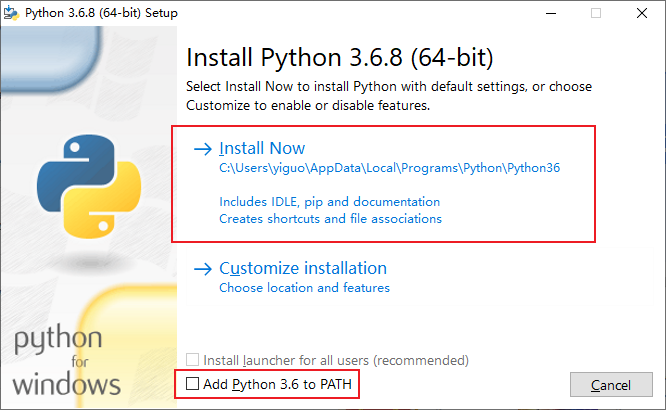
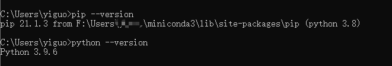

# Python网络爬虫与推荐算法的新闻推荐平台

#### 介绍
网络爬虫：通过Python实现新浪新闻的爬取，可爬取新闻页面上的标题、文本、图片、视频链接（保留排版）
推荐算法：权重衰减+标签推荐+区域推荐+热点推荐


- 权重衰减进行用户兴趣标签权重的衰减，避免内容推荐的过度重复
- 标签推荐进行用户标签与新闻标签的匹配，按照匹配比例进行新闻的推荐
- 区域推荐进行IP区域确定，匹配区域性文章进行推荐
- 热点推荐进行新闻热点的计算的依据是新闻阅读量、新闻评论量、新闻发布时间


涉及框架：Django、jieba、selenium、BeautifulSoup、vue.js

#### 软件功能结构/页面展示


用户端
](https://images.gitee.com/uploads/images/2021/0522/092955_1dc4513b_5294263.png "2.png")


管理端


#### 保姆级安装教程
1. 安装Python环境

   安装包下载：https://www.python.org/ftp/python/3.6.8/python-3.6.8-amd64.exe
   

   然后就是各种下一步，安装完就行了，测试安装是否成功就打开CMD

   ```
   pip --version
   python --version
   ```

   出现下面的内容就是安装成功了

   

1. 安装Python依赖

   Python就一个文件夹"FinalProject"

   打开CMD -->  `cd F:\code\NewsRecommends\FinalProject` (注意此处的路径是我本地的，改成你自己电脑上的即可)

   执行 `pip install -r requirements.txt`安装Python项目运行的所需依赖

3. 安装NodeJS

   下载地址：https://nodejs.org/dist/v16.14.2/node-v16.14.2-x64.msi

   一直下一步就完事了

4. 安装NodeJS依赖

   前端页面分成了两个项目，所以两个项目都需要分别安装依赖

   用户端前端：News-Page

   打开CMD -->  `cd F:\code\NewsRecommends\News-Page` (注意此处的路径是我本地的，改成你自己电脑上的即可)

   执行 `npm install`安装NodeJS所需依赖

   

   管理端前端：vue-admin-template-master

   打开CMD -->  `cd F:\code\NewsRecommends\vue-admin-template-master` (注意此处的路径是我本地的，改成你自己电脑上的即可)

   执行 `npm install`安装NodeJS所需依赖

   

   注：这个过程很慢，并且有可能因为网络超时导致失败之类的，所以自己多试几次

   

5. 数据库创建/数据导入

   数据库使用的是MySQL，没安装的可以下载一个[phpstudy](https://public.xp.cn/upgrades/phpStudy_64.zip)（小皮面板）

   MySQL安装了就比较难卸载干净了，卸载不干净下次安装必报错，所以不建议新手去捣鼓，不信邪的也可以去试试

   小皮面板上直接启动MySQL服务就行了

   然后就是使用Navicat去连接MySQL服务器

   默认账号/密码应该都是 root

   然后新建一个news数据库 把目录`F:\code\NewsRecommends\FinalProject`下的news.sql导入到数据库中

6. 项目数据库配置

```python
F:\code\NewsRecommends\FinalProject\newsapi\newsServer\settings.py
DATABASES = {
    'default': {
        'ENGINE': 'django.db.backends.mysql',
        'NAME': 'news',
        'USER': 'root', // 自己的数据库账号
        'PASSWORD': 'root', // 自己的数据库密码
        'HOST': '127.0.0.1',
        'PORT': '3306',
    }
}

F:\code\NewsRecommends\FinalProject\newsapi\Spider\OperationMysql.py
    def __init__(self):
        self.conn = pymysql.connect(
            host='127.0.0.1',  # 连接的数据库服务器主机名
            port=3306,  # 数据库端口号
            user='root',  # 数据库登录用户名
            passwd='root',
            db='news',  # 数据库名称
            charset='utf8',  # 连接编码
            cursorclass=pymysql.cursors.DictCursor
        )
```

**到此所有需要安装的东西都安装完了**

#### 启动

1.  Django项目启动

```bash
# 打开CMD
cd F:\code\NewsRecommends\FinalProject\newsapi
# 注意此处的路径是我本地的，改成你自己电脑上的即可
python manage.py runserver 0.0.0.0:8000
```

2.  前端项目启动


```bash
//用户端 （改成自己的路径）
cd F:\code\NewsRecommends\News-Page
npm run dev 
//管理端 （改成自己的路径）
cd F:\code\NewsRecommends\vue-admin-template-master
npm run serve
```

#### 使用

可以直接看到的是两个页面

客户端：

http://127.0.0.1:8080

管理端：

http://127.0.0.1:9090

然后爬虫的状态是因为我数据的记录是开着的，所以需要自己手动把数据库里的爬虫和解析器状态都改成关闭

news_api_spiderstate表

status这一列全部改成0

然后再到管理端打开就完事了

时间设置的短一些，不然你等半天也不会有数据

**会Linux的其实放到Linux可能会更好用一些，不会就按照上述方法进行**


## PS

这是一个普通本科的毕业设计项目，耗时1个月左右，一个人独立完成开发（前端+后端），所以细节可能并不是那么到位，完成的项目也懒得继续去优化了，但是基本的功能该有的都有吧，所以如愿以偿的获得一个比较高分的答辩结果，拿我项目去做毕设的人也大有人在，论文就不要找我要了，白嫖也有个度，问我卖不卖的我也不太想搭理，因为我开的价你未必给得起，做之前我还特意去问了毕设贩子，同类型同题材的项目1500RMB，所以自重。知道用这个项目的都是学生，所以要钱没啥意义。

这个项目没有用多么高深的推荐算法，所以跟机器学习的大佬们没法比~

有问题私聊、加群问都行，太小白的问题，我就不太想回复了，上面保姆级教程该说的都说了

毕设能不能拿高分就看各位自己的造化了

愿意的就点个星，不愿意的就算啦，佛系~


## 问题交流群：
原有的交流群已经解散了哈，确实工作比较忙，没办法维护和协助大家解决问题，有问题加微信或者邮件沟通吧，能回复我尽量回复，不能回复也请尽量！！微信我主页可见。